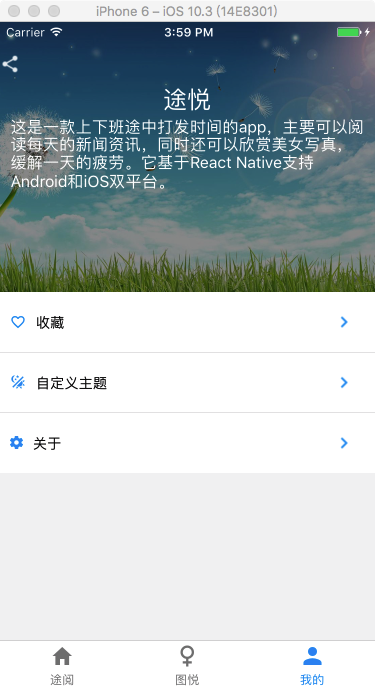
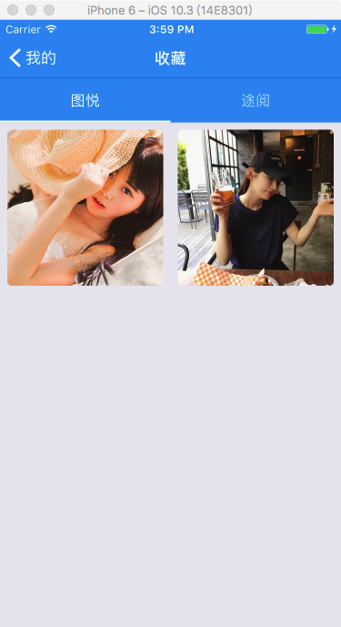

# ReactNative-Tooyue

This is a app that passes the time on the way to commute. It can read daily news and information, as well as enjoy beautiful pictures, relieve the fatigue of a day. It is based on React Native to support both Android and iOS dual platforms.

## Contents

- [Preview](#preview)
- [Screenshots](#screenshots)
- [Features](#features)
- [Requirements](#requirements)
- [Library](#library)
- [Running](#running)
- [TODO](#todo)
- [License](#license)

## App preview

## Screenshots

## Features

- [x] react-navigation implementation of page navigation;
- [x] use react-native-vector-icons icon;
- [x] get equipment related information;
- [x] banner;
- [x] FlatList show news，WebView look at the news;
- [x] Tinder-like swipe cards，right slide collection of pictures;
- [x] multiple color themes to switch freely;
- [x] news, picture collection
- [x] aliyun feedback

## Requirements

* [react](https://github.com/facebook/react): 16.0.0-alpha.12
* [react-native](https://github.com/facebook/react-native): 0.48.4

## Library

* [react-native-vector-icons](https://github.com/oblador/react-native-vector-icons) - 3000 Customizable Icons for React Native with support for NavBar/TabBar/ToolbarAndroid, image source and full stying
* [react-native-device-info](https://github.com/rebeccahughes/react-native-device-info) - Device Information for React Native iOS and Android
* [react-native-parallax-scroll-view](https://github.com/i6mi6/react-native-parallax-scroll-view) - A ScrollView-like component with parallax and sticky header support
* [react-native-photo-browser](https://github.com/ksti/react-native-photo-browser) - Local and remote media gallery with captions, selections and grid view support for react native
* [react-native-splash-screen](https://github.com/crazycodeboy/react-native-splash-screen) - A splash screen for react-native, hide when application loaded ,it works on iOS and Android
* [react-native-tinder-swipe-cards](https://github.com/meteor-factory/react-native-tinder-swipe-cards) - Tinder-like swipe cards for your React Native app
* [react-native-tab-view](https://github.com/react-native-community/react-native-tab-view) - A cross-platform Tab View component for React Native
* [react-navigation](https://github.com/react-navigation/react-navigation) - Learn once, navigate anywhere

## Running

#### Clone & install

* Clone this repo `git@github.com:songguoping/ReactNative-Tooyue.git`
* `cd ReactNative-Tooyue`
* run `npm install`
* run `react-native link`

#### iOS

* Run `react-native run-ios`

#### Android

* Run `android avd` and start an emulator
* Run `react-native run-android`

## TODO

**V1.1.0 planning**

- [ ] QQ、WeChat share
- [ ] version update
- [ ] ...

## License

Released under the [MIT License](http://opensource.org/licenses/MIT).

